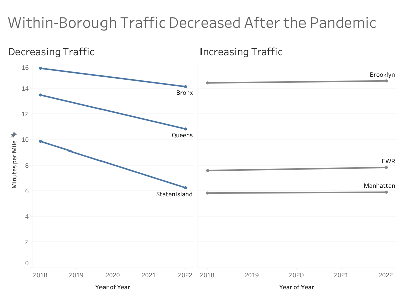

## about the project

Recent articles suggest New York City experienced a massive population shift during the COVID-19 pandemic. The present study seeks to understand the impact of this population shift on predictive analytics through the lens of a logistics company, like Uber or FedEx. Specifically, Bayesian parameter estimation is used on the NYC Taxi dataset in order to compare pre-pandemic and post-pandemic traffic levels. This analysis showed that indeed, traffic volume decreased over the observation period consistent with a decrease in population. Next, XGB Regression models are fit to pre- and post-pandemic data to simulate a company, like Uber, who wanted to predict the average trip speed within New York. The analysis shows despite the decreases in traffic, the predictive models trained on either pre- or post-pandemic data are not significantly different. These results suggest that pre-pandemic data is still a valuable resource in modeling traffic dynamics within New York City.

|                    |            |                |                   |
| -----------------: | :--------- | -------------: | :---------------- |
| **date created:**  | dec 2022   | **duration:**  | 2 months          |
| **project type:**  | statistics | **my role:**   | bayesian analysis |
| **collaborators:** | alex dreo  | **stack:**     | julia             |
|                    |            |                | python            |

## challenges

#### validating the research hypothesis
Bayesian parameter estimation is used to describe the distribution of traffic within each borough for each time period. The goal here is to model the amount of traffic for a single borough in 2018 and again in 2022. Examining all the boroughs, the Bronx, Queens, and Staten Island all show posterior predictive traffic means in 2018 greater than their corresponding values in 2022. The Brooklyn, EWR, and Manhattan boroughs all increased, however, the differences in the posterior predictive means are minimal.

| Borough       | Model     | 2018 Mean | 2022 Mean |
|:--------------|:----------|----------:|----------:|
| Bronx         | Prior     | 5.21      | 5.65      |
|               | Posterior | 10.37     | 8.50      |
| Brooklyn      | Prior     | 5.42      | 5.66      |
|               | Posterior | 9.02      | 8.93      |
| EWR           | Prior     | 5.46      | 5.46      |
|               | Posterior | 2.15      | 2.39      |
| Manhattan     | Prior     | 5.69      | 5.69      |
|               | Posterior | 0.14      | 0.22      |
| Queens        | Prior     | 5.85      | 5.25      |
|               | Posterior | 7.64      | 5.58      |
| Staten Island | Prior     | 5.37      | 5.33      |
|               | Posterior | 4.49      | 0.92      |

#### predicting trip speeds
XGBRegressor models are built to estimate trip speed using the full dataset. Given a set of twenty-one predictive variables, LASSO cross-validation is implemented to reduce variance and improve interpretability by limiting the number of predictive factors. 

After all of these features are added, feature selection to remove multicollinearity is necessary. LassoCV is implemented to select the following predictive factors: 'RatecodeID', 'airport_fee', 'congestion_surcharge', 'extra', 'fare_amount', 'tip_amount', 'tolls_amount', 'total_amount', and 'trip_hours'. The final mean squared errors (MSE) of the 2018 and 2022 models are 2.68 vs 2.76 respectively.

## solution

The present study demonstrated an observable decreases in traffic volume over the course of the pandemic with Bayesian parameter estimation. Given this information, should companies be concerned with the impacts a change in population may cause on their predictive traffic models? No, the traffic models generated in this study showed little to no differences when trained on pre- and post-pandemic data. This similarity suggests that a singular predictive model may be used to predict average trip speed pre- and post-pandemic, without a loss in accuracy, despite the change in population.
